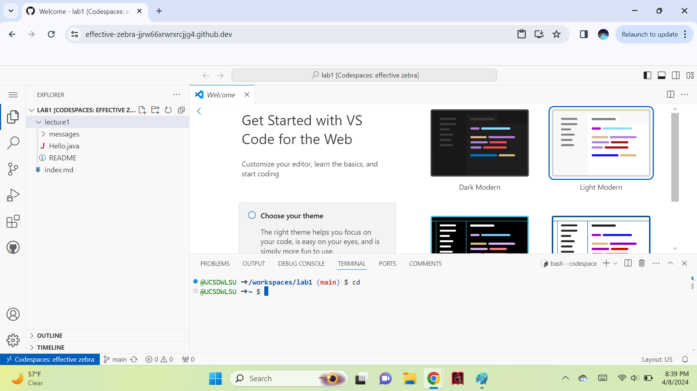
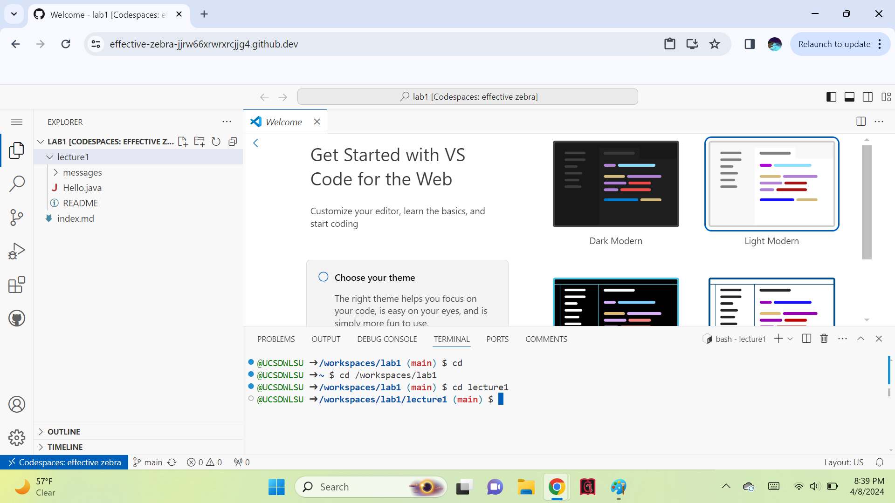
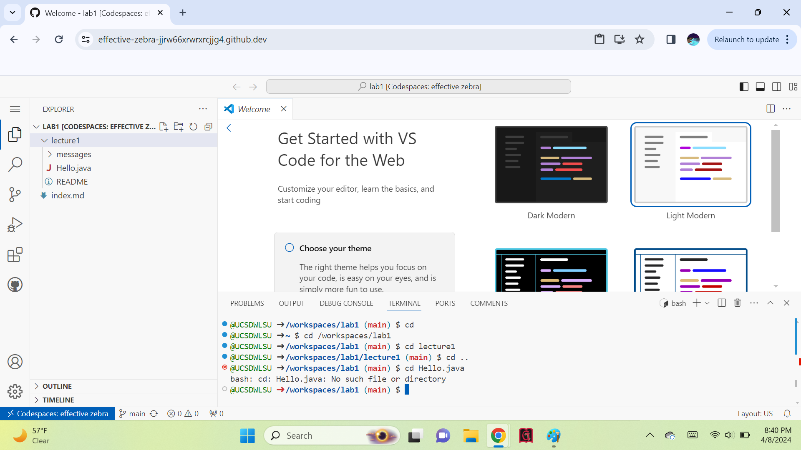
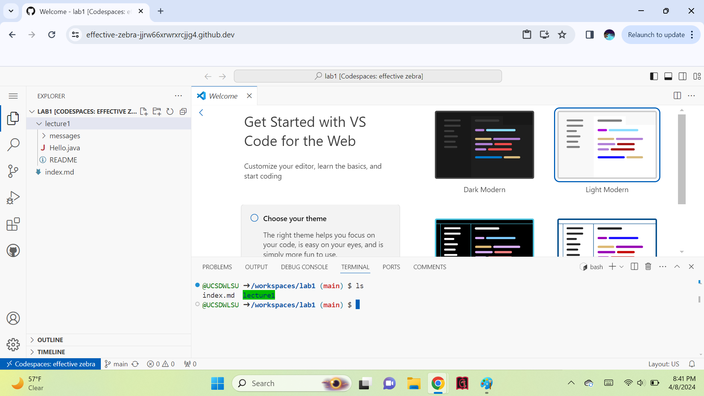
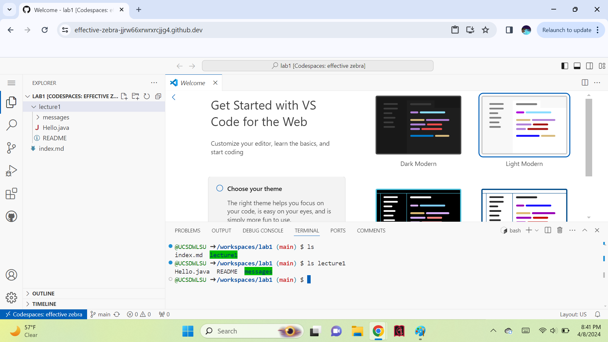
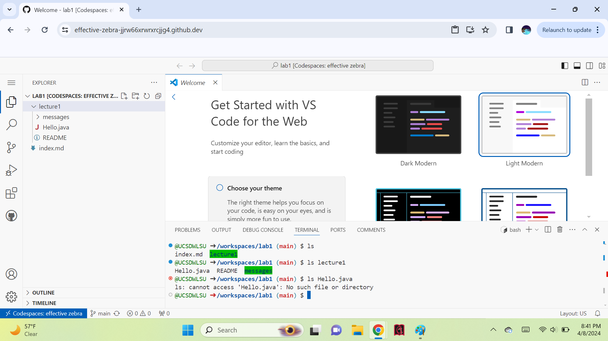
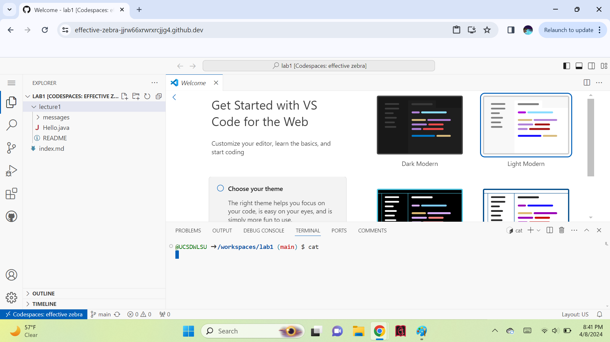
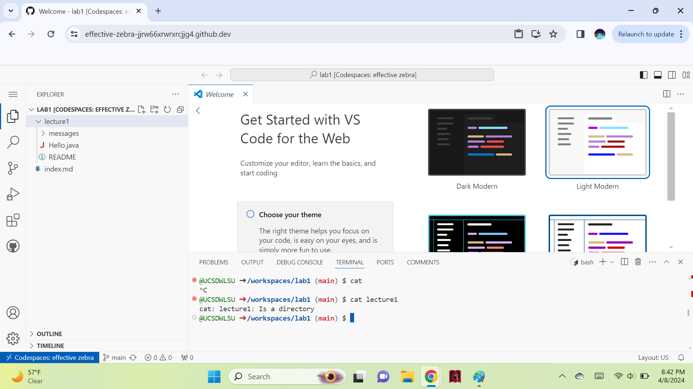
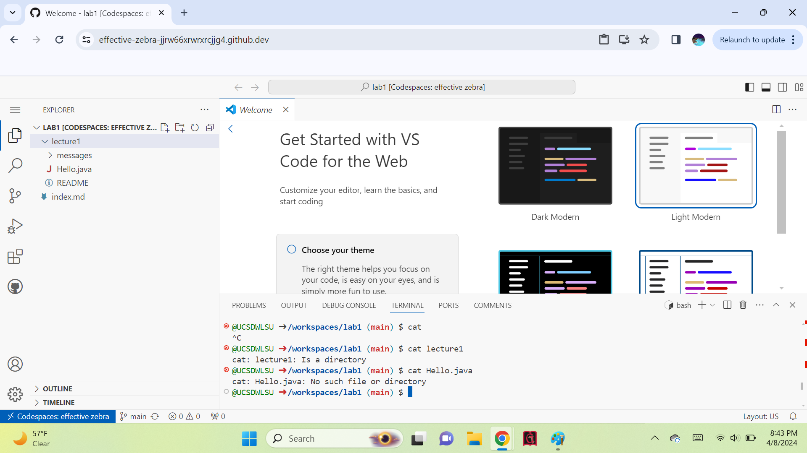

Command Run: "cd"
\Absolute Path Before Running Command: /workspaces/lab1
\Why The Output: Because no argument is given, the absolute path/working directory is voided.
\Output Error? If So Why: No.

Command Run: "cd lecture1"
Absolute Path Before Running Command: /workspaces/lab1
Why The Output: Because a directory argument is given, the absolute path/working directory is changed to the argument.
Output Error? If So Why: No.

Command Run: "cd Hello.java"
Absolute Path Before Running Command: /workspaces/lab1
Why The Output: Because a file argument is given, not a directory argument, the terminal says "cd: Hello.java: No such file or directory".
Output Error? If So Why: No.

----------------------------------------------------------------------------------------------------------------------------------------------------------------------------
Command Run: "ls"
Absolute Path Before Running Command: /workspaces/lab1
Why The Output: Because no argument is given, the files within the absolute path/working directory are listed.
Output Error? If So Why: No.

Command Run: "ls lecture1"
Absolute Path Before Running Command: /workspaces/lab1
Why The Output: Because a directory argument is given, the files within the argument [directory] are listed.
Output Error? If So Why: No.

Command Run: "ls Hello.java"
Absolute Path Before Running Command: /workspaces/lab1
Why The Output: Because a file argument is given, not a directory argument, the terminal says "ls: cannot access 'Hello.java': No such file or directory".
Output Error? If So Why: No.

----------------------------------------------------------------------------------------------------------------------------------------------------------------------------
Command Run: "cat"
Absolute Path Before Running Command: /workspaces/lab1
Why The Output: Because no argument is given, the terminal enters a loop.
Output Error? If So Why: The ouput is an error because the terminal enters enters a loop. Commands no longer work until you exit the loop by pressing "Ctrl+C".

Command Run: "cat lecture1"
Absolute Path Before Running Command: /workspaces/lab1
Why The Output: Because a directory argument is given, not a file argument, the terminal says "cat: lecture1: Is a directory".
Output Error? If So Why: No.

Command Run: "cat Hello.java"
Absolute Path Before Running Command: /workspaces/lab1
Why The Output: Because a file argument is given, and the file isn't within the absolute path/working directory, the file cannot be concatenated.
Output Error? If So Why: No.

----------------------------------------------------------------------------------------------------------------------------------------------------------------------------

