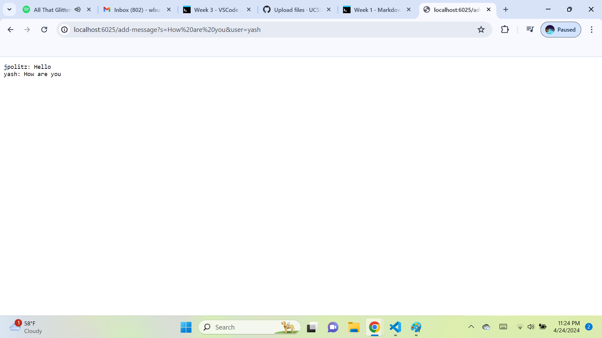

**ChatServer.java Code:**
'import java.io.IOException;
import java.net.URI;

class ChatHandler implements URLHandler {
    // The single string that gets added to by incoming requests
    String chatLog = "";

    public String handleRequest(URI url) {
        if (url.getPath().startsWith("/add-message")) {
            String[] parameters = url.getQuery().split("&");
            String message = "";
            String user = "";
            for (String param : parameters) {
                String[] keyValue = param.split("=");
                if (keyValue[0].equals("s")) {
                    message = keyValue[1];
                } else if (keyValue[0].equals("user")) {
                    user = keyValue[1];
                }
            }
            if (!message.isEmpty() && !user.isEmpty()) {
                chatLog += user + ": " + message + "\n";
                return chatLog;
            }
        }
        return "404 Not Found!";
    }
}

// ChatServer.java
public class ChatServer {
    public static void main(String[] args) throws IOException {
        if (args.length == 0) {
            System.out.println("Missing port number! Try any number between 1024 to 49151");
            return;
        }

        int port = Integer.parseInt(args[0]);

        Server.start(port, new ChatHandler());
    }
}'

 **Image:**
 **Which methods in your code are called?**
 **What are the relevant arguments to those methods, and the values of any relevant fields of the class?**
 **How do the values of any relevant fields of the class change from this specific request? If no values got changed, explain why.**

 **Image:**
 **Which methods in your code are called?**
 **What are the relevant arguments to those methods, and the values of any relevant fields of the class?**
 **How do the values of any relevant fields of the class change from this specific request? If no values got changed, explain why.**
