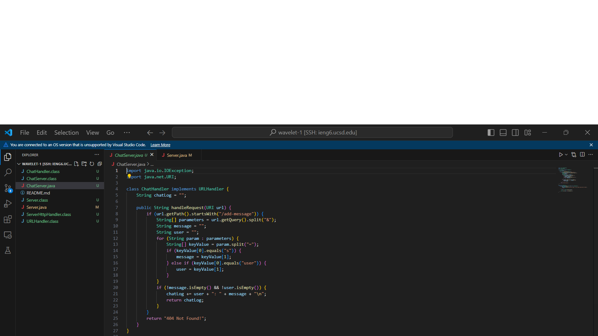
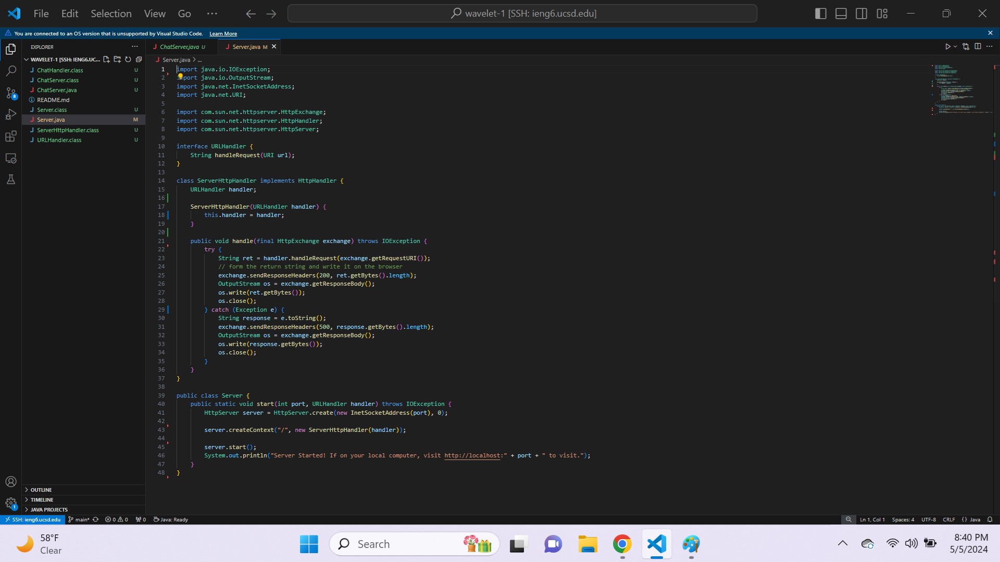
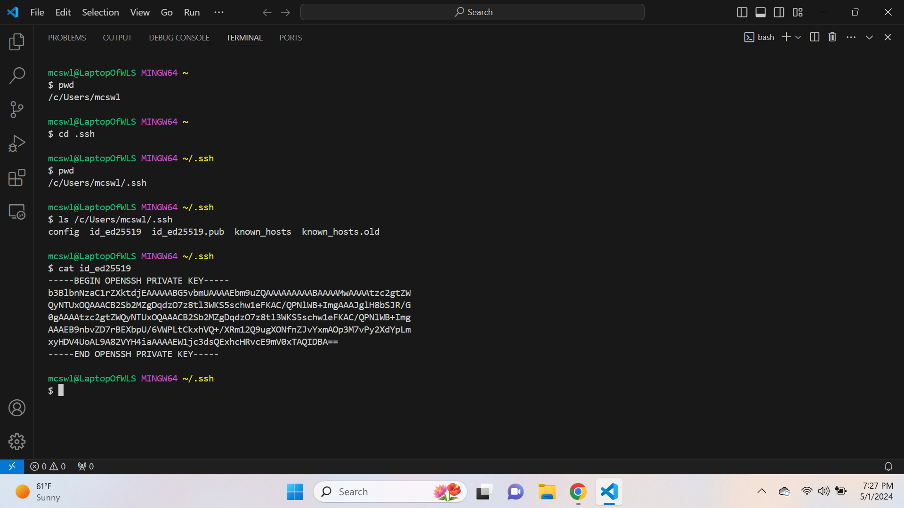
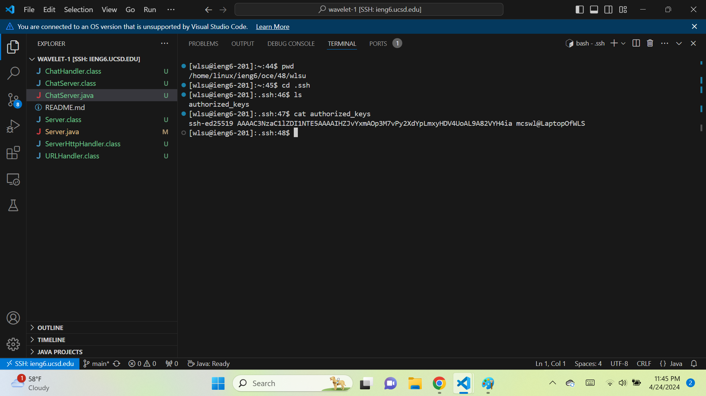
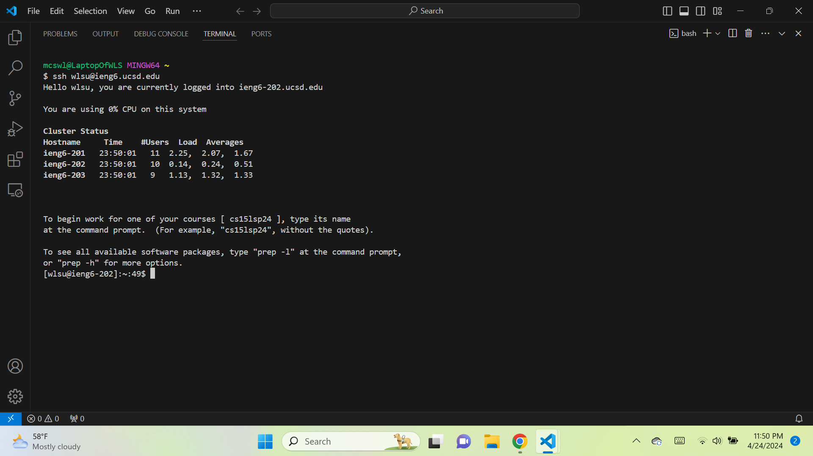

**ChatServer.java Code:**
 **Image:**

**Server.java Code:**
 **Image:**

 **Image:**
 **Which methods in your code are called?**
 **What are the relevant arguments to those methods, and the values of any relevant fields of the class?**
 **How do the values of any relevant fields of the class change from this specific request? If no values got changed, explain why.**

 **Image:**
 **Which methods in your code are called?**
 **What are the relevant arguments to those methods, and the values of any relevant fields of the class?**
 **How do the values of any relevant fields of the class change from this specific request? If no values got changed, explain why.**

 **Image:**
 **Image:**
 **Image:**

 **What I learned from Week 2 and/or 3:**
Since I took this course back in Fall Quarter, I already know/remember most of the material taught in Weeks 2 and 3. The few things I forgot/don't remember are the following five commands: `echo` `>` `scp` `scp -r` `ssh-copy-id -i`. Also, I learned how to connect to a remote server on VS Code (I don't think my previous professor taught this. Either that or I don't remember him teaching this.). The things I learned last time I took it though are the following: how to connect to a server via "ssh" command / how to run a server through terminal / how to setup SSH Keys.
