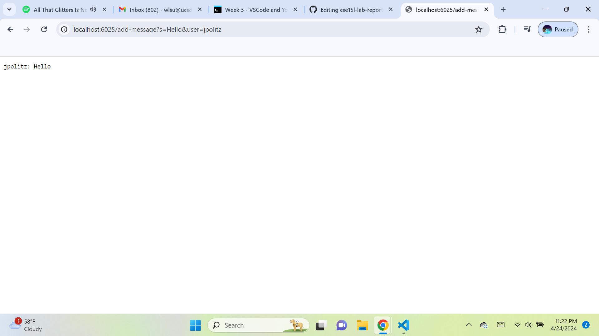

**ChatServer.java Code:**
import java.io.IOException;
import java.net.URI;

class ChatHandler implements URLHandler {
    String chatLog = "";

    public String handleRequest(URI url) {
        if (url.getPath().startsWith("/add-message")) {
            String[] parameters = url.getQuery().split("&");
            String message = "";
            String user = "";
            for (String param : parameters) {
                String[] keyValue = param.split("=");
                if (keyValue[0].equals("s")) {
                    message = keyValue[1];
                } else if (keyValue[0].equals("user")) {
                    user = keyValue[1];
                }
            }
            if (!message.isEmpty() && !user.isEmpty()) {
                chatLog += user + ": " + message + "\n";
                return chatLog;
            }
        }
        return "404 Not Found!";
    }
}

public class ChatServer {
    public static void main(String[] args) throws IOException {
        if (args.length == 0) {
            System.out.println("Missing port number! Try any number between 1024 to 49151");
            return;
        }

        int port = Integer.parseInt(args[0]);

        Server.start(port, new ChatHandler());
    }
}

**Server.java Code:**
import java.io.IOException;
import java.io.OutputStream;
import java.net.InetSocketAddress;
import java.net.URI;

import com.sun.net.httpserver.HttpExchange;
import com.sun.net.httpserver.HttpHandler;
import com.sun.net.httpserver.HttpServer;

interface URLHandler {
    String handleRequest(URI url);
}

class ServerHttpHandler implements HttpHandler {
    URLHandler handler;

    ServerHttpHandler(URLHandler handler) {
        this.handler = handler;
    }

    public void handle(final HttpExchange exchange) throws IOException {
        try {
            String ret = handler.handleRequest(exchange.getRequestURI());
            // form the return string and write it on the browser
            exchange.sendResponseHeaders(200, ret.getBytes().length);
            OutputStream os = exchange.getResponseBody();
            os.write(ret.getBytes());
            os.close();
        } catch (Exception e) {
            String response = e.toString();
            exchange.sendResponseHeaders(500, response.getBytes().length);
            OutputStream os = exchange.getResponseBody();
            os.write(response.getBytes());
            os.close();
        }
    }
}

public class Server {
    public static void start(int port, URLHandler handler) throws IOException {
        HttpServer server = HttpServer.create(new InetSocketAddress(port), 0);

        server.createContext("/", new ServerHttpHandler(handler));

        server.start();
        System.out.println("Server Started! If on your local computer, visit http://localhost:" + port + " to visit.");
    }
}

 **Image:**
 **Which methods in your code are called?**
 **What are the relevant arguments to those methods, and the values of any relevant fields of the class?**
 **How do the values of any relevant fields of the class change from this specific request? If no values got changed, explain why.**

 **Image:**
 **Which methods in your code are called?**
 **What are the relevant arguments to those methods, and the values of any relevant fields of the class?**
 **How do the values of any relevant fields of the class change from this specific request? If no values got changed, explain why.**

 **Image:**
 **Image:**
 **Image:**
