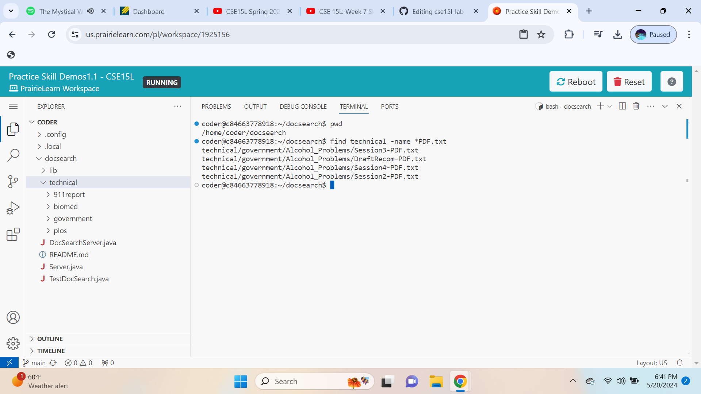
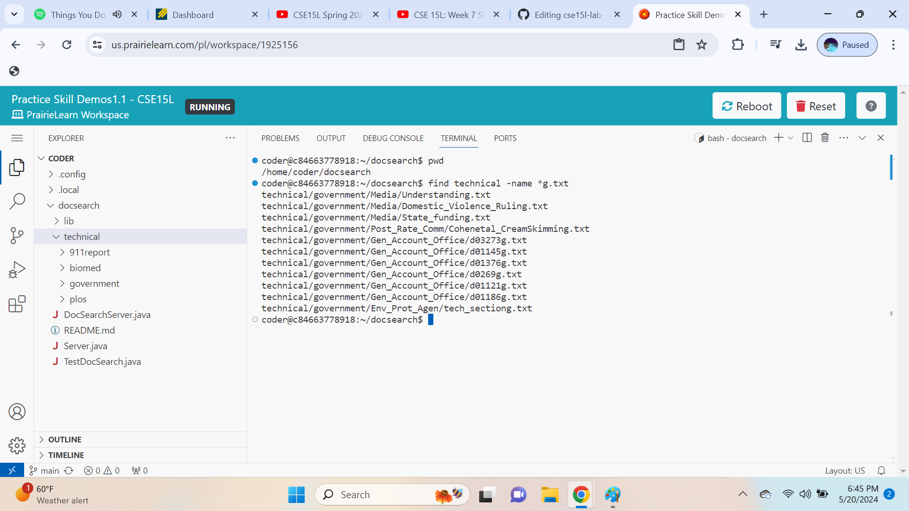
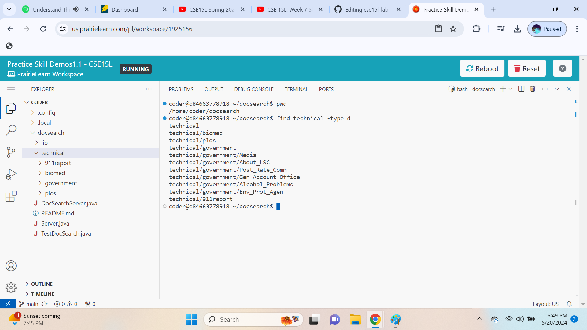
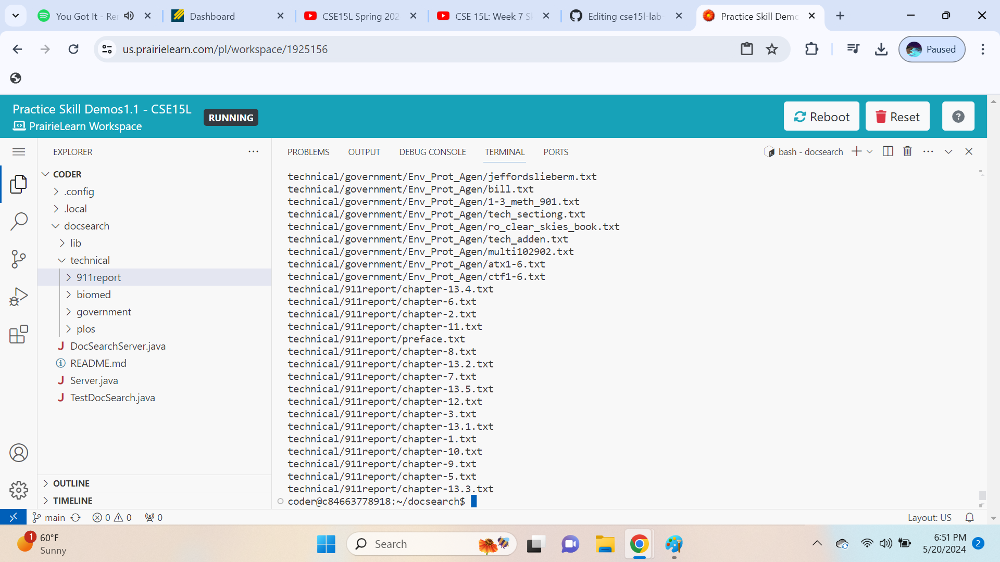
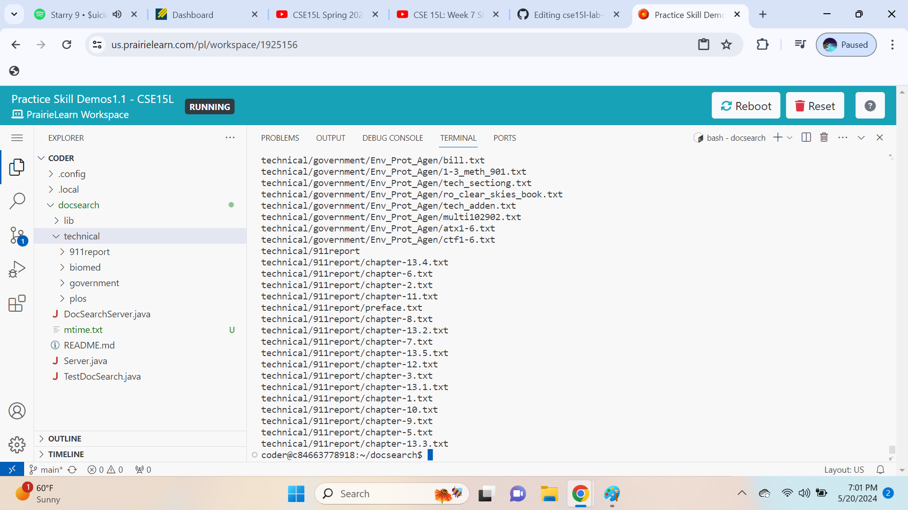
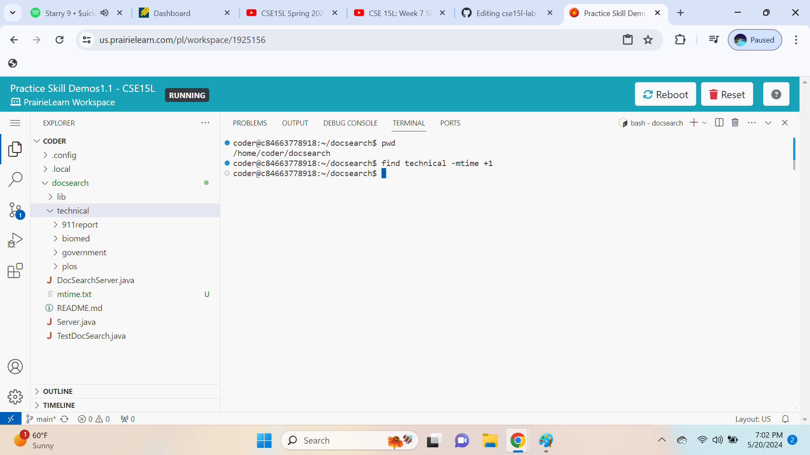
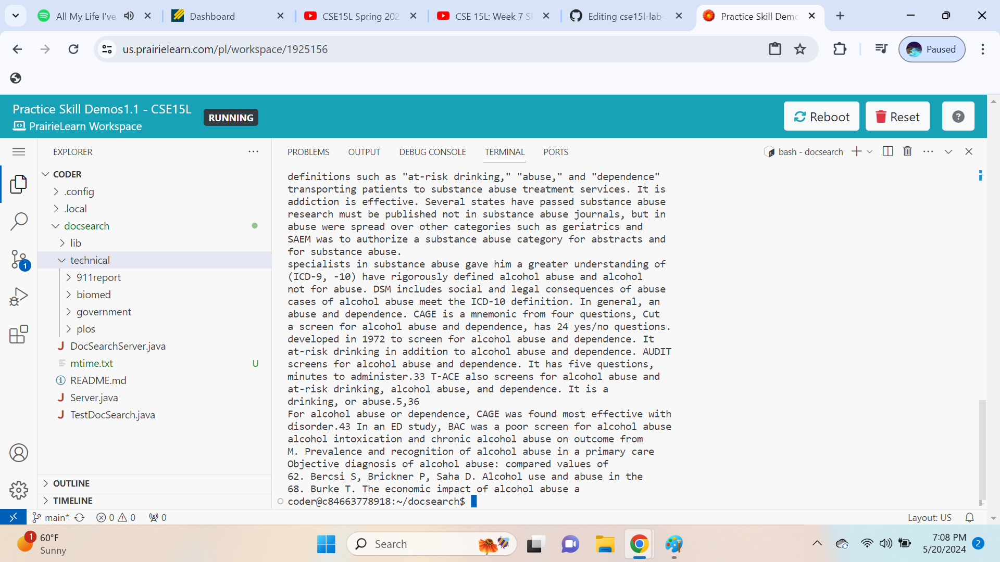
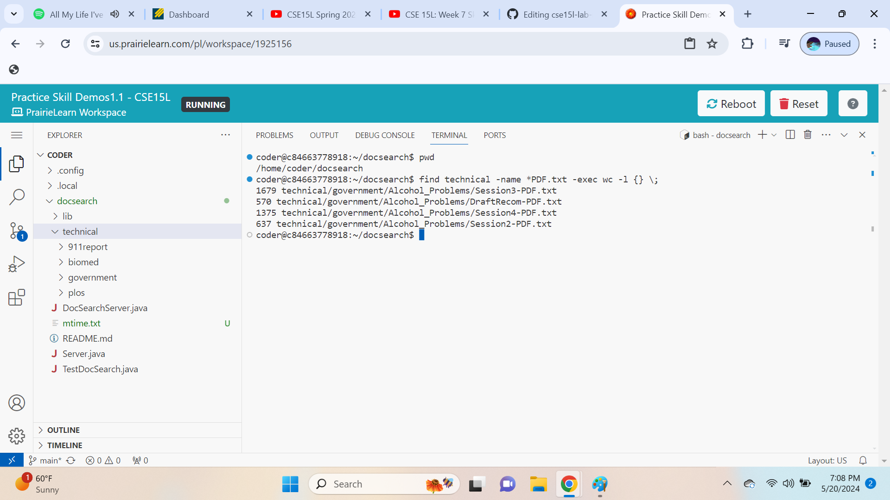

 **1 (Failure-Inducing Input JUnit Test):**
 

 **2 (Non-Failure-Inducing Input JUnit Test):**
 

 **3 (Failing Test):**
 

 **3 (Passing Test):**
 

 **4 (Before Bug Fix):**
 

 **4 (After Bug Fix):**
 

 **5 (Why Fix Works):**
 
The original code was overwriting the first half of the array with the second half before those values could be swapped, thus losing the original values. The fixed version of the code uses a temporary variable to hold the value being replaced, and it only iterates over the first half of the array (`arr.length / 2`). This ensures that each element is swapped only once, preserving the order of the elements in reverse.

____________________________________________________________________________________________________________________________________________________________________________

**Command:** `find`

**Option 1:** `-name`
 **Functionality:** The -name option in the find command allows the user to search for files whose names match a specified pattern.
 **Usefulness:** This option is particularly useful for locating files with specific naming conventions or extensions, making file management more efficient.
 Example 1: `find technical -name *.txt` | This command searches for all text files (*.txt) within the technical directory.
 
 Example 2: `find technical -name *PDF.txt` | This command looks for files ending with PDF.txt in the technical directory, useful for finding specific types of documents.
 

**Option 2:** `-type`
 **Functionality:** The -type option specifies the type of file to find. Common types include d for directories and f for regular files.
 **Usefulness:** This helps in segregating search results based on the file type, which is essential for organizing or processing only certain types of files.
 Example 1: `find technical -name d` | This command finds all directories within the technical folder.
 
 Example 2: `find technical -name f` | This command finds all regular files within the technical folder.
 

**Option 3:** `-mtime`
 **Functionality:** The -mtime option is used to find files based on the modification time, specified in days. The prefix - finds files modified less than the given days ago, while + finds files modified more than the given days ago.
 **Usefulness:** This option is crucial for managing files based on their modification dates, which can be important for backup, archiving, or cleanup tasks.
 Example 1: `find technical -mtime -1` | This command searches for files modified within the last day in the technical directory.
 
 Example 2: `find technical -mtime +1` | This command finds files modified more than one day ago in the technical directory.
 

**Option 4:** `-exec`
 **Functionality:** The -exec option allows the execution of a command on each file found. This command can perform any operation available to the shell on those files.
 **Usefulness:** This feature is highly powerful for processing or manipulating files directly from the search output, avoiding the need for separate commands.
 Example 1: `find technical -name *PDF.txt -exec grep abuse {} \;` | This command searches within files named *PDF.txt for the string "abuse."
 
 Example 2: `find technical -name *PDF.txt -exec wc -l abuse {} \;` | This command counts the lines in files ending with PDF.txt.
 
