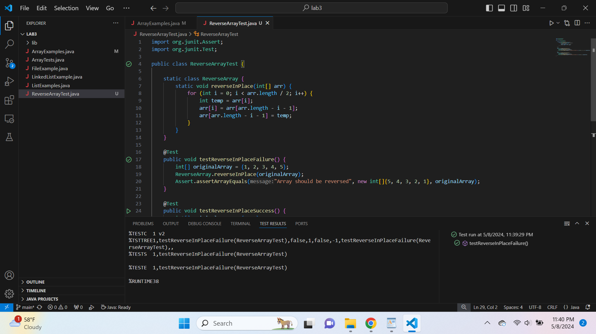

 **1:**
 

 **2:**
 

 **3(fail):**
 

 **3(success):**
 

 **4(before):**
 

 **4(after):**
 

 **5:**
 
The original code was overwriting the first half of the array with the second half before those values could be swapped, thus losing the original values. The fixed version of the code uses a temporary variable to hold the value being replaced, and it only iterates over the first half of the array (`arr.length / 2`). This ensures that each element is swapped only once, preserving the order of the elements in reverse.
