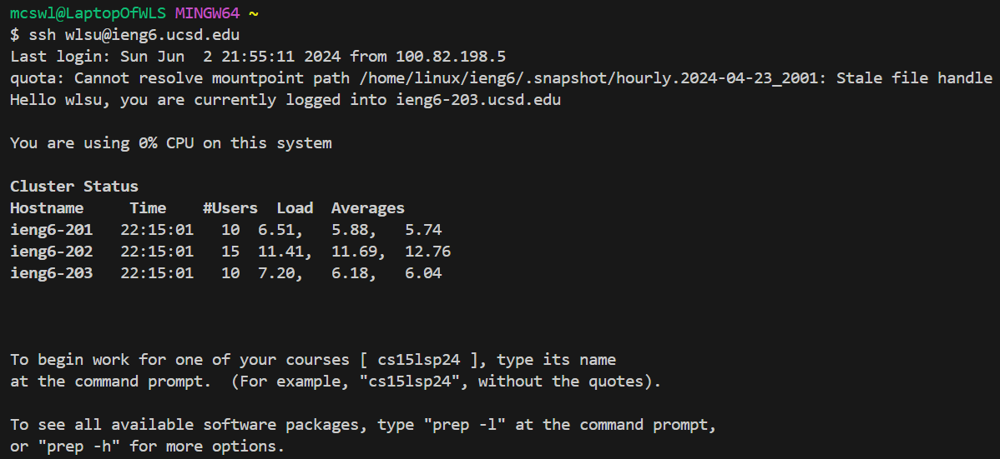
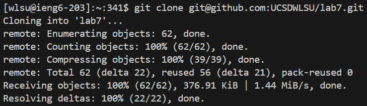
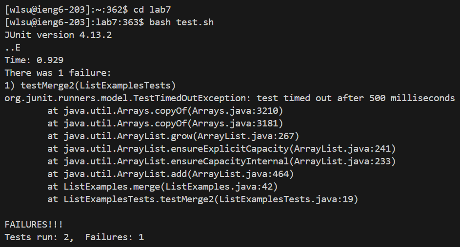
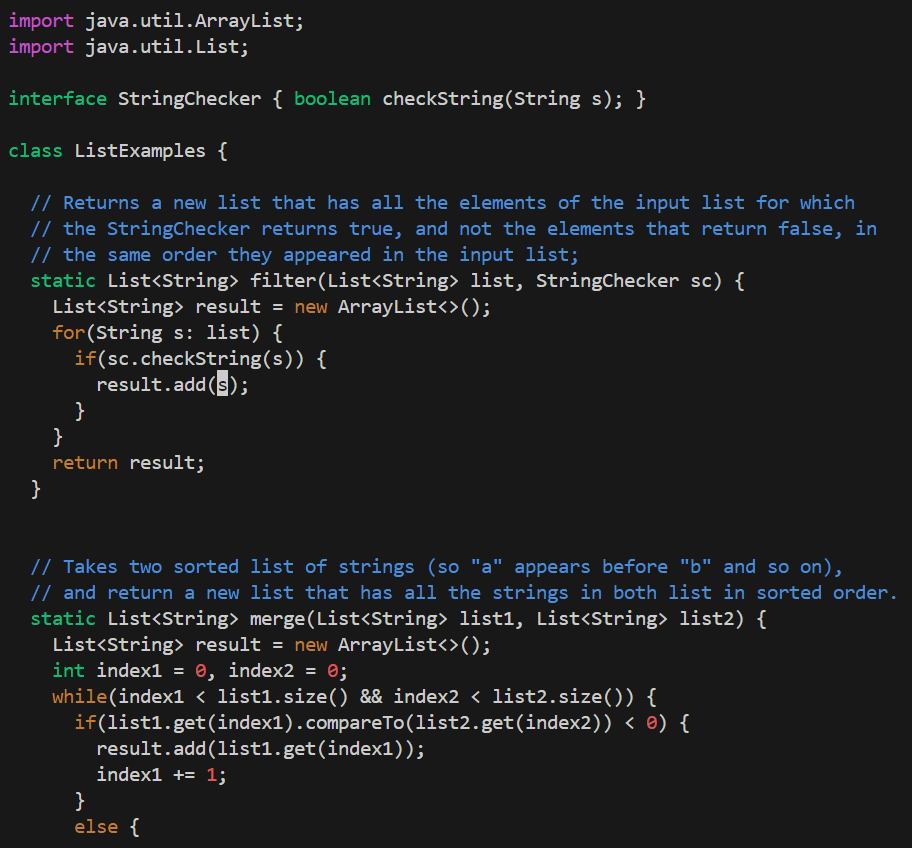
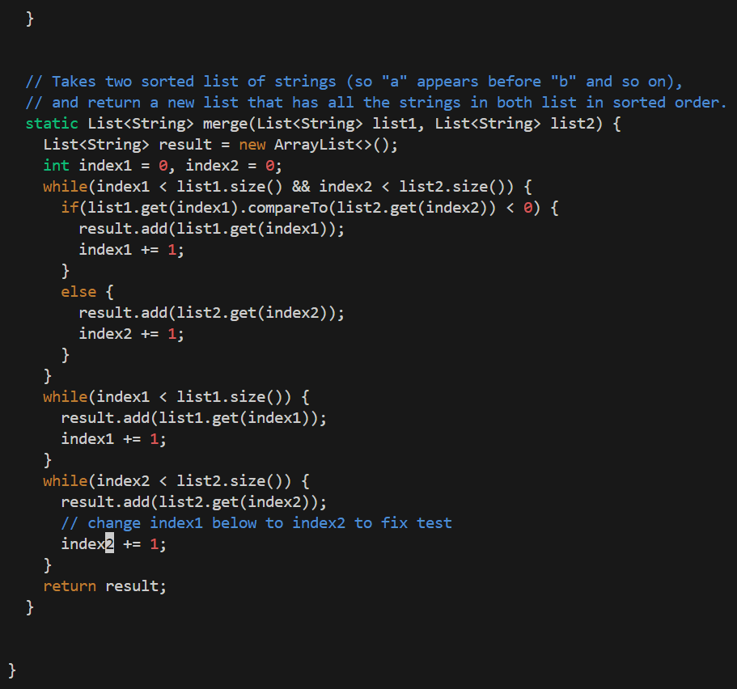
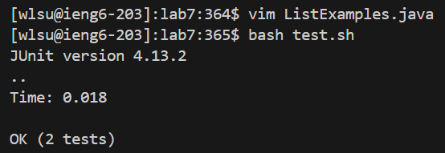
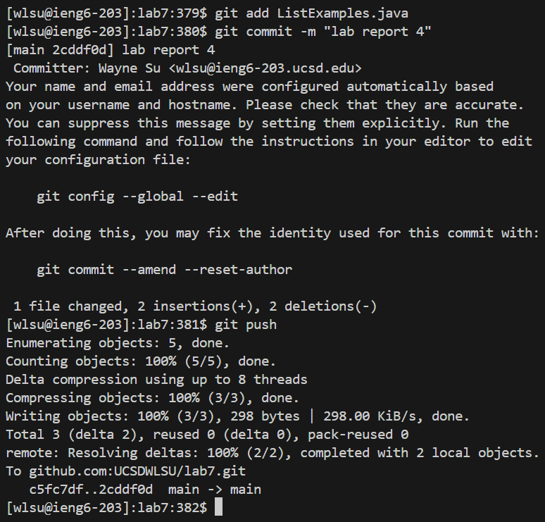

**STEP 4**
 **Command:** `ssh<space>wlsu@ieng6.ucsd.edu<enter>`
 **Effect:** This command connects to the remote server `ieng6.ucsd.edu` using SSH with the username `wlsu`.
 

**STEP 5**
 **Command:** `git<space>clone<space>git@github.com:UCSDWLSU/lab7.git<enter>`
 **Effect:** This command clones the repository located at `git@github.com:UCSDWLSU/lab7.git` into the local directory.
 

**STEP 6**
 **Command:** `cd<space>lab7<enter>` / `bash<space>test.sh<enter>`
 **Effect:** First, the command changes the current working directory to `lab7`. Then, the `bash test.sh` command runs the `test.sh` script located in the `lab7` directory.
 

**STEP 7**
 **Command:** `vim<space>ListExamples.java<enter>` `<Down>x14<Right>x22<i><Backspace>x3<Down>x29<Left>x6<Backspace>2<Esc>:wq<enter>`
 **Effect:** `vim ListExamples.java` opens the file `ListExamples.java` in the Vim text editor. Navigated down 14 lines, then moved right 22 characters to position the cursor. Entered insert mode, deleted 3 characters using the backspace key. Moved down 29 lines, then left 6 characters to position the cursor again. Deleted 1 character, replaced it with the character `2`. Exited insert mode and saved the changes by writing and quitting Vim with `:wq`.
 
 

**STEP 8**
 **Command:** `bash<space>test.sh<enter>`
 **Effect:** This command reruns the `test.sh` script to test the changes made in the `ListExamples.java` file.
 

**STEP 9**
 **Commands:** `git<space>add<space>ListExamples.java<enter>` / `git<space>commit<space>-m<space>"lab<space>report<space>4"<enter>` / `git<space>push<enter>`
 **Effects:** `git add ListExamples.java` stages the changes in ListExamples.java for the next commit. `git commit -m "lab report 4"` commits the staged changes with the message "lab report 4". `git push` pushes the local commits to the remote repository.
 
