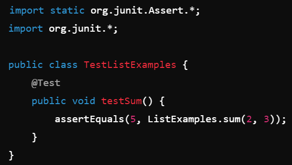

**1. The original post from a student with a screenshot showing a symptom and a description of a guess at the bug/some sense of what the failure-inducing input is.**
 **Title:** Issue with list-examples-grader Script Execution
 **Post:**
Hi everyone,

I’m encountering an issue while trying to run the grading script for our list examples project. When I run `grade.sh`, I receive an unexpected output and the grading process doesn't complete as expected. Attached is a screenshot of the terminal output I get.

From what I can tell, it seems like there might be an issue with the file paths or maybe the Java compilation. Has anyone experienced something similar or has an idea of what might be going wrong?

**Screenshot:**
 

**2. A response from a TA asking a leading question or suggesting a command to try.**
 **Title:** Re: Issue with list-examples-grader Script Execution
 **Post:**
Hi Wayne,

It looks like there might be an issue with how the paths are set in your script. Could you try running the following command and share the output?

`ls -R`

This will list all the files and directories recursively from your current location. It might help us identify if there’s a discrepancy in your file structure.

**3. Another screenshot/terminal output showing what information the student got from trying that, and a clear description of what the bug is.**
 **Title:** Re: Issue with list-examples-grader Script Execution
 **Post:**
Hi TA Edwin,

Thanks for the suggestion. Here’s the output from running `ls -R`.

It seems like the `ListExamples.java` file is located in a different directory than the script expects. The script is looking for the file in the `src` directory, but it’s actually in the `examples` directory.

The bug is likely due to incorrect file paths in the `grade.sh` script. I’ll try updating the paths and see if that resolves the issue.

**Screenshot:**
 

**Explanation:** In step 3 of the lab report, the problem was solved by correcting the file paths in the grade.sh script. The original script had incorrect paths, leading to failures when trying to access necessary files for grading. By updating these paths to the correct locations, the script was able to find and process the files correctly. This fix worked because the script relied on accurate file locations to function properly, and ensuring the paths were correct allowed it to execute as intended.

**4a. The file & directory structure needed**

**Screenshot:**
 

**4b. The contents of each file *before* fixing the bug**

**ListExamples.java**
 

**TestListExamples.java**
 

**grade.sh**
 

**4c. The full command line (or lines) you ran to trigger the bug**

`bash grade.sh`

**4d. A description of what to edit to fix the bug**

Update the file paths in the `grade.sh` script to correctly point to the `examples` directory where `ListExamples.java` is located.

**Corrected `grade.sh`**
 

By changing the path from `src/ListExamples.java` to `examples/ListExamples.java`, the script will now correctly locate and compile the necessary Java files, allowing the tests to run successfully.

**Reflection:**
In the second half of this class, I learned a handful of new things, such as Vim, JDB, and Bash/Bash Scripting. Specifically with Vim, I learned how to essentially code/edit completely from the terminal/command line, which I find extremely cool (maybe just because I'm trying to get into Cybersecurity). With JDB (Java Debugger), I learned how to properly run it on a main class [with the use of a password], granted I only know the basics and am still learning the syntax/common commands. And with Bash/Bash Scripting, I learned a good amount of common and helpful commands, and learned that there's a way to automate code, respectively. Oh, and I also learned (I don't think it was during the second half of this class) how to connect to a remote SSH (Secure Shell Protocol) server, and how to create SSH keys.
